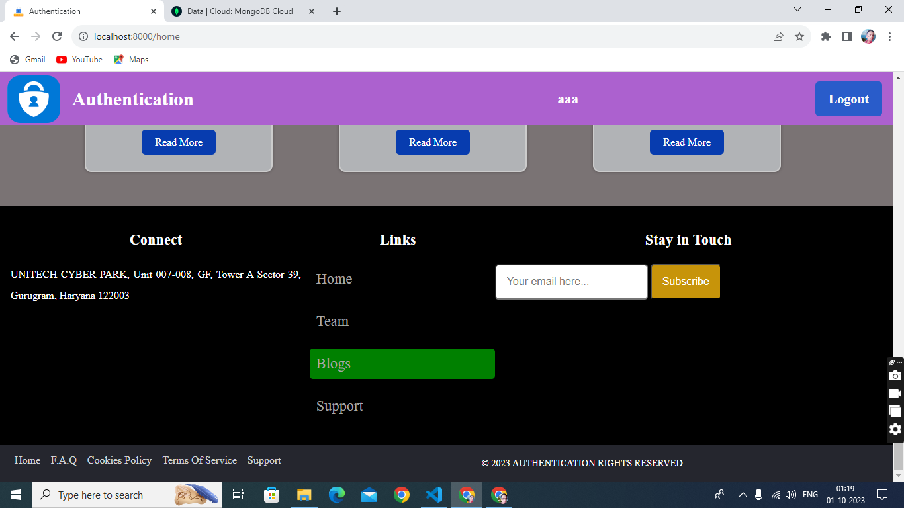

# NodeJs Authentication

## Description
✍ To create a complete authentication system which can be used as a starter code for creating any new
application.

### Click the Go Live button and see the live  [Go Live]()

# Languages and Tools Used
- ### Language
    - #### Frontend
        - HTML
        - CSS
        - Bootstrap
        - EJS
    - #### Backend
        - Javascript
        - NodeJs
        - Express
- ### Tools
    - #### MongoDB
        - Mongoose
    - #### Github
        - git
    - #### Passport
    - #### VS Code
    - ##### Etc.

## Features
- Sign up with email/Manual
- Sign in (you can redirect to a blank home page with a sign out and reset password button
after sign in)
- Sign out
- Reset password/Forgot password after sign in
- The password stored in the db should be encrypted
- Google login/signup (Social authentication).

## Folder Structure
- ### assets
    - ##### CSS
        - home
        - layout
        - login
        - reset
        - signup
    - #### images
        - fotter
        - home
        - login
        - resetPassword
        - signup
- ### config
    - #### middleware
    - #### mongoose
    - #### passport JWT
    - #### passport local
    - #### passport google
- ### controller
    - #### userController
- ### models
    - #### User
- ### routes
    - #### index
- ### views
    - #### portail
        - massages
    - #### home
    - #### layout
    - #### login
    - #### resetPassword
    - #### signup
- ### index
- ### package.json
- ### README.md

- # Screenshorts
- ### SignUp Page
- 
- ### LogIn Page
- 
- ### Reset Password Page
- 
- ### Home Page
- 
- ### Fotter Page
- 